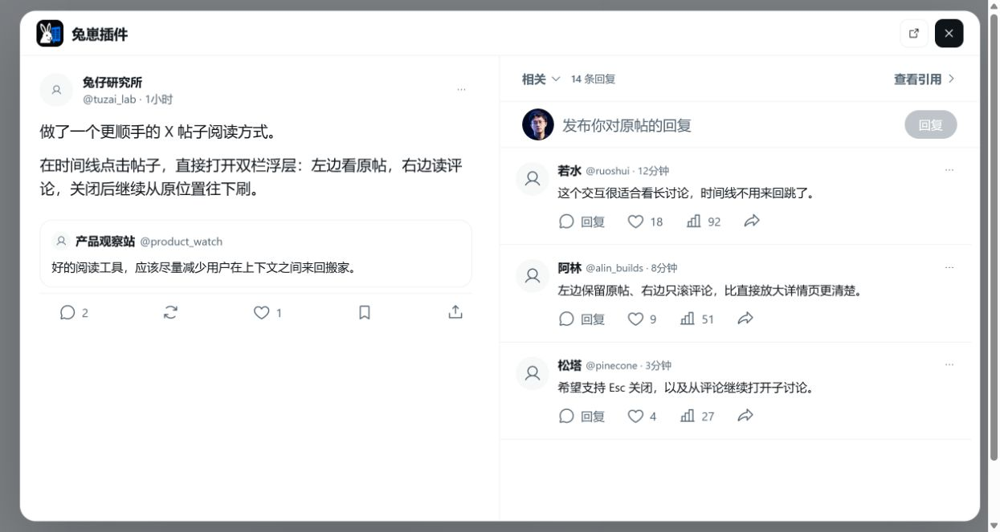

# 兔崽插件

[查看更新日志](CHANGELOG.md) · [参与贡献](CONTRIBUTING.md) · [隐私说明](PRIVACY.md)

一个给网页版 X 使用的 Chrome 扩展。在主页、通知等帖子列表里点击帖子时，不再跳走，而是在当前页面打开一个左右双栏浮层：左边看原帖，右边读评论，关闭后继续从原来的位置刷。

> 本项目是社区维护的非官方工具，与 X Corp. 没有关联，也没有得到其赞助或认可。X 和 Twitter 是其各自权利人的商标。



## 01 它解决什么问题

在网页版 X 的帖子列表中点击一条帖子，通常会直接进入详情页。看完以后还要返回，时间线的位置也可能发生变化。
兔崽插件把这个过程改成了浮层阅读。帖子和评论放在同一个窗口里，左右两栏各自滚动；关掉浮层以后，页面仍然停在打开前的位置。
如果已经进入 `/status/...` 帖子详情页，插件不会重复拦截普通帖子和回复，继续保留 X 原生交互；但点击回复里的引用帖卡片时，会单独打开这条引用帖的浮层。

## 02 现在能做什么

- **双栏阅读**：桌面端正文大约占 52%，评论区大约占 48%。正文略宽一些，两边都能独立滚动。
- **完整显示帖子**：支持普通帖子、图片、视频、引用帖、网站预览卡片和 X 长文完整正文，不只是显示一条链接或摘要卡片。在列表里直接点击引用帖卡片，会打开引用帖本身，不会误开外层主帖。
- **保留回复上下文**：从通知等列表点开一条回复时，左侧会显示它前面的对话链，并自动定位到被点击的回复；向上滚动仍能查看完整上文。
- **自动加载评论**：评论区接近底部时会自动读取下一批。没有更多评论以后会真正停止，不再反复出现加载提示。
- **纯文字回复**：可以回复原帖或某条评论。输入框平时保持紧凑，点击后展开，并随着文字增加自动变高。回复成功后，新内容会出现在评论区顶部。
- **基础互动**：支持点赞和取消点赞、转发和取消转发、收藏和取消收藏，以及复制帖子链接。互动按钮保持 X 的顺序，鼠标移上去时会把图标和数字一起包住。
- **作者资料卡**：鼠标放在头像、昵称或账号名上，可以查看作者简介、关注数、粉丝数和关系信息，也可以直接关注或取消关注。鼠标在作者信息和资料卡之间移动时不会闪烁。
- **自动翻译**：“自动翻译外语帖子”默认开启，也可以在扩展设置里关闭。开启后，原帖、引用帖和当前滚动到的外语评论会默认显示中文，并保留“显示原文 / 显示翻译”切换；同一标签页里已经翻译过的帖子会直接复用结果。
- **评论排序**：支持相关、最新和最多喜欢三种排序。“相关”沿用 X 返回的默认顺序，另外两种排序作用于当前已经加载的评论。
- **视频播放**：优先播放 X 的自适应 HLS 视频，主帖和即将进入视口的视频会提前准备，后台 Worker 负责解封装，并在同一标签页复用已经测得的带宽；没有 HLS 时再按当前网络选择合适的 MP4。视频按真实宽高比显示，引用帖视频也不会被固定高度截断。
- **页面位置保护**：浮层不会修改 X 页面 `body` 或 `html` 的滚动方式，关闭以后恢复打开前的页面坐标。
- **主题与开关**：支持浅色、暗色和熄灯主题；可以从扩展工具栏随时开启或关闭。
- **多种关闭方式**：按 `Esc`、点击遮罩或点击右上角关闭按钮都可以退出浮层，右上角也能直接在 X 中打开当前帖子。

## 03 它是怎么工作的

插件使用 Content Script 监听 X 动态帖子列表里的点击。它不会把 X 的 React 节点搬进浮层，也不会用两张网页或隐藏标签页来拼界面。
帖子和评论数据来自当前页面已经登录的 X 会话。插件会从 X 当前运行的网页代码中动态发现 GraphQL 操作定义，再自己渲染固定的左右双栏；如果 GraphQL 偶尔缺少作者、头像、时间或媒体信息，才会使用点击瞬间读取的轻量 DOM 数据补齐缺失字段。
翻译直接使用当前登录的 X 会话和 X 自己的翻译服务；评论只在滚动到附近时才请求翻译，最多同时处理两条，不会阻塞原帖、图片或视频的读取。视频播放器、HLS 支持和界面图标都随扩展本地打包，不需要远程加载播放器脚本或图标字体。

**插件不使用 iframe、隐藏标签页、第三方数据服务器、硬编码 GraphQL 查询 ID，也不会复制或修改 X 的 React DOM。**

## 04 隐私和权限

扩展只申请两类权限：
- `storage`：只用来保存插件开关和是否自动翻译；不保存帖子正文、译文或登录凭据。
- `x.com` / `twitter.com`：在 X 页面显示浮层，并用当前登录会话读取和操作帖子。

扩展不申请 Cookie、标签页、DNR、webRequest、全站或其他网站权限。登录请求头和 CSRF 信息只在当前 X 页面内存中临时使用，不写入扩展存储，不输出到日志，也不会发给第三方服务器。
更完整的说明见 [PRIVACY.md](PRIVACY.md)。

## 05 安装到 Chrome

项目目前还没有发布到 Chrome 应用商店，需要以“加载已解压的扩展程序”的方式安装。
最低要求：Git、Node.js 20+、npm 10+，以及 Chrome 或其他 Chromium 浏览器。

Windows PowerShell、macOS、Linux 和 Git Bash 都可以使用下面这组命令：

```bash
git clone https://github.com/xuntianx/tuzai-x-popover.git
cd tuzai-x-popover
npm install
npm run build:extension
```

构建完成后：
1. 打开 `chrome://extensions/`。
2. 开启右上角的“开发者模式”。
3. 点击“加载已解压的扩展程序”。
4. 选择仓库里的 `dist-extension/` 文件夹。
5. 刷新已经打开的 X 标签页。

以后更新代码后，重新执行 `npm run build:extension`，再到扩展管理页点击“重新加载”即可。

## 06 本地开发

启动可交互的界面预览：

```bash
npm run dev
```

构建界面预览和 Chrome 扩展：

```bash
npm run build
```

运行全部自动化测试并重新构建产物：

```bash
npm test
```

当前测试会检查帖子链接、引用帖目标与媒体归属解析、详情页避让、回复上下文、评论分页、图片和视频识别、网站卡片、X 长文、用户数据、扩展权限、图标与播放器本地打包，以及预览站点构建。目前共有 **28 项测试**。

## 07 当前边界

- 回复编辑器目前只支持纯文字，但插件不再限制 280 个字符，也不显示字符上限提示。长回复最终能否发布由当前 X 账号权限与 X 服务端决定；图片、视频、GIF、投票、草稿和高级 @ 提及建议仍需从右上角进入 X 完成。
- “最新”和“最多喜欢”只会重新排列已经加载到浮层里的评论，不会改变 X 服务端返回评论的方式。
- X 内部 GraphQL 不是公开稳定 API。插件会动态发现当前页面的操作定义，但 X 大幅修改请求结构时，解析器仍可能需要跟着更新。
- 点赞、转发、收藏等互动会先在界面中更新；如果 X 拒绝请求，插件会回滚状态并显示错误。
- 自动翻译依赖 X 当前网页使用的内部翻译接口。翻译失败时会继续显示原文，并允许手动重试，不会影响帖子和媒体阅读。

## 08 参与贡献

这个项目已经使用 MIT License 开源，欢迎一起完善帖子解析、评论交互、X 改版兼容、自动化测试、文档和界面细节。
提交代码前请先阅读 [CONTRIBUTING.md](CONTRIBUTING.md)。发现普通问题可以提交 [GitHub Issue](https://github.com/xuntianx/tuzai-x-popover/issues)；涉及安全或隐私的问题，请按 [SECURITY.md](SECURITY.md) 私下报告，不要直接公开敏感信息。

## 09 项目结构

```text
extension/       Chrome 扩展源码
src/             可交互的视觉演示
scripts/         构建脚本
tests/           核心逻辑与预览 Worker 测试
docs/            界面预览和设计验收图片
dist-extension/  构建后的可加载扩展，不提交到 Git
```

项目代码使用 [MIT License](LICENSE) 开源，第三方组件许可证见 [THIRD_PARTY_NOTICES.md](THIRD_PARTY_NOTICES.md)。
