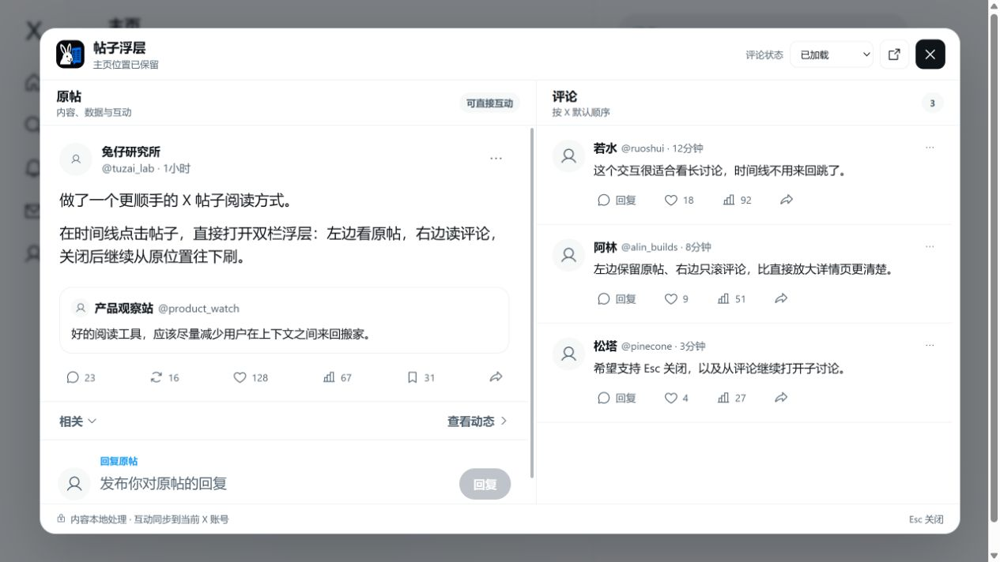

# 兔仔 · X 帖子浮层阅读器

一个本地优先的 Chrome 扩展：在 X 时间线点击帖子正文时，不离开主页，直接用双栏浮层阅读原帖和评论。



## 现在能做什么

- 拦截时间线里的帖子正文点击，保留主页滚动位置。
- 左侧展示点击的原帖，右侧展示当前账号可见的评论。
- 浮层内可直接回复、点赞、转发、收藏和分享，操作同步到当前登录的 X 账号。
- 保留查看量、查看动态和帖子链接等原生入口。
- 支持浅色、暗色和熄灯主题。
- `Esc`、遮罩或右上角按钮都可以关闭浮层。
- 插件工具栏里可以随时开启或关闭。
- 评论加载失败、暂无评论和加载中都有明确状态。

## 隐私与权限

扩展只申请：

- `storage`：保存开启/关闭状态。
- `tabs`：在浮层打开期间保留一个不激活的帖子详情页，用来读取评论并代为执行互动；关闭浮层后自动关闭。
- `x.com` / `twitter.com`：只在 X 页面注入浮层。

扩展不申请 Cookie 权限，不访问其他网站，也没有第三方数据服务。评论读取使用当前已登录的 X 页面；帖子内容只在浏览器本地处理。

## 本地开发

最低要求：Node.js 20+、npm 10+、Chrome 或其他 Chromium 浏览器。

Windows PowerShell：

```powershell
npm install
npm run test
npm run build
```

macOS / Linux / Git Bash：

```bash
npm install
npm run test
npm run build
```

开发预览：

```bash
npm run dev
```

## 加载到 Chrome

1. 执行 `npm run build:extension`。
2. 打开 `chrome://extensions/`。
3. 开启右上角“开发者模式”。
4. 点击“加载已解压的扩展程序”。
5. 选择仓库里的 `dist-extension/`。
6. 首次加载后刷新已经打开的 X 标签页。

## 当前边界

- 点赞、回复、转发和收藏会真实作用于当前登录的 X 账号；回复发送前仍由用户在浮层里输入并主动点击“回复”。
- 为避免依赖经常变化的 X 内部接口，读取和互动都复用一个不激活的 X 详情标签页；该标签页只在浮层打开期间存在。
- “更多”菜单在浮层中提供复制链接和在 X 打开完整菜单；X 未来增加的菜单项不会被插件凭空复制。
- X 页面结构更新后，帖子选择器可能需要跟随调整。

## 项目结构

```text
extension/       Chrome 扩展源码
src/             可交互的视觉演示
scripts/         构建脚本
tests/           核心逻辑与预览 Worker 测试
dist-extension/  构建后的可加载扩展（不入 Git）
```
